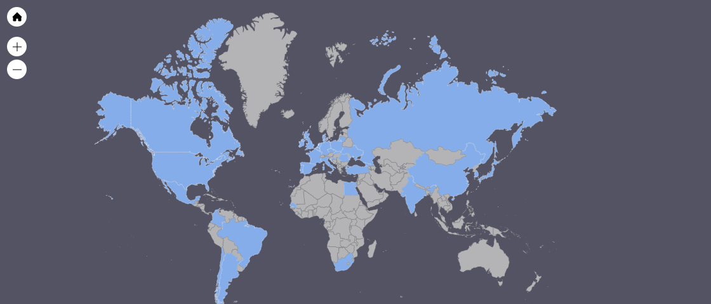

# Hi I'm Carlos, a software engineer. 😋

## My main interest are:

- <b> Blockchain </b>: web3 development with real world applications.🔑⚖️ 💸
-  <b> Game development. </b> 🎮 
- <b> Artificial Inteligence. </b>🦾🤖🧠

# Checkout my projects and businesses at my web 👔

### [My Web (not completely finished :D)](https://personal-web-site-web-dev-next-js.vercel.app/)

### [My Linked-In](https://www.linkedin.com/in/carlos-alegre-urquiz%C3%BA-0b19701b3/)

## Some & Main Technologies I've been in contact with 👨‍💻👨‍💻👨‍💻

### Langugaes

 <table>
 <tbody>
 <tr>
 <td>  </td>
 <td></td>
 <td> </td>
 <td> </td>
 </tr>

 <tr>
 <td> </td>
 <td> </td>
 <td> </td>
 <td> </td>
 </tr>

 <tr>
 <td> </td>
 <td> </td>
 <td> </td>
 <td> </td>
 </tr>

 <tr>
 <td>Assembly x86</td>
 <td> </td>
 </tr>
 </tbody>
 </table>
 
 
 ### Frameworks
   <table>
 <tbody>
 <tr>
 <td>Hardhat</td>
 <td></td>
 <td>NextJs</td>
 <td></td>
 <td>React</td>
 <td></td>
 </tr>
 </tbody>
 </table>

## About my learning process 📝
I studied for <b> 2 years at UAB </b> (Autonomous University of Barcelona) <b> learning all the basics of IT </b> 🤓 and then <b> dropped out </b> to specialize on my own. 🧐 

This was due to the <b> feeling of going too slow </b> and general 🤭 at my univesity's pace and due to really <b> wanting to start working fully focused on my own project </b> ideas. 🚀🤓🚀

## ⚡ Fun fact ⚡ 

I have a big wide social network. Friends and contacts in 36 countries.

TODO: Make this prettier 🙆‍♂️

<!--

**CarlosAlegreUr/CarlosAlegreUr** is a ✨ _special_ ✨ repository because its `README.md` (this file) appears on your GitHub profile.

Here are some ideas to get you started:

- 🔭 I’m currently working on ...
- 🌱 I’m currently learning ...
- 👯 I’m looking to collaborate on ...
- 🤔 I’m looking for help with ...
- 💬 Ask me about ...
- 📫 How to reach me: ...
- 😄 Pronouns: ...
- ⚡ Fun fact: ...
-->
